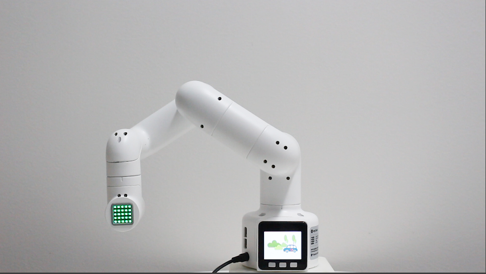

# MyCobot

This repo contains example scripts to play around with your myCobot-Pi. To control
the robot with hand gestures you'll need to install mediapipe.

**Note:** Throughout this text "server" refers to your laptop or PC where you run the
computer vision models or connect your SpikerBox; and "client" refers to the RaspberryPi
of your myCobotPi.

## Requirements

### Client
* Python3
* zmq
* pymycobot

### Server
* mediapipe
* Arduino IDE
* opencv-python

## Setup